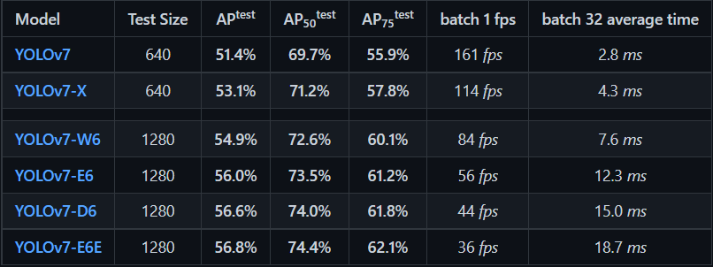
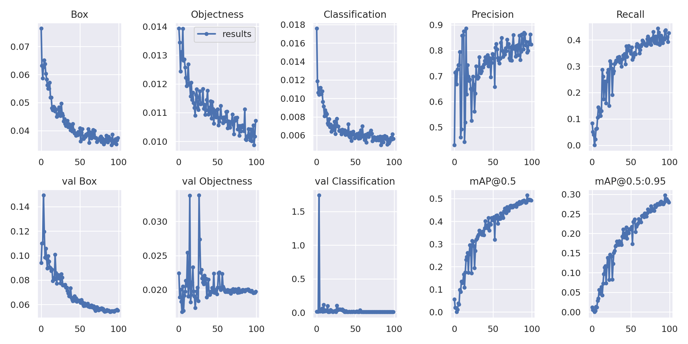
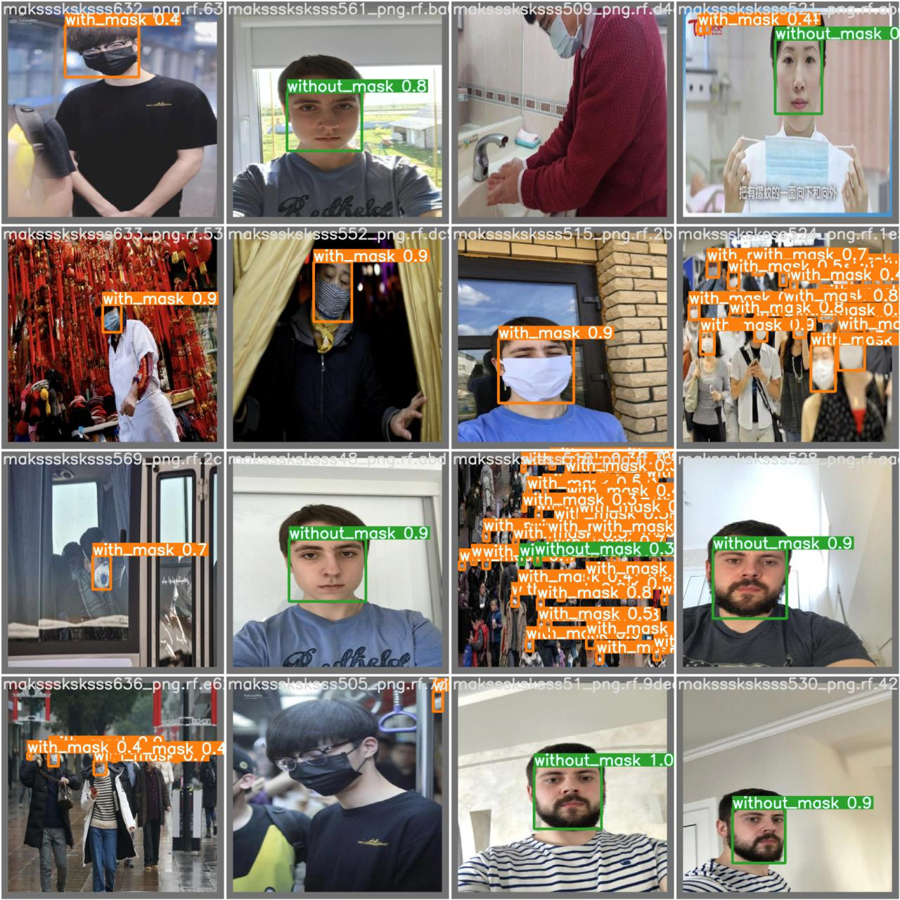
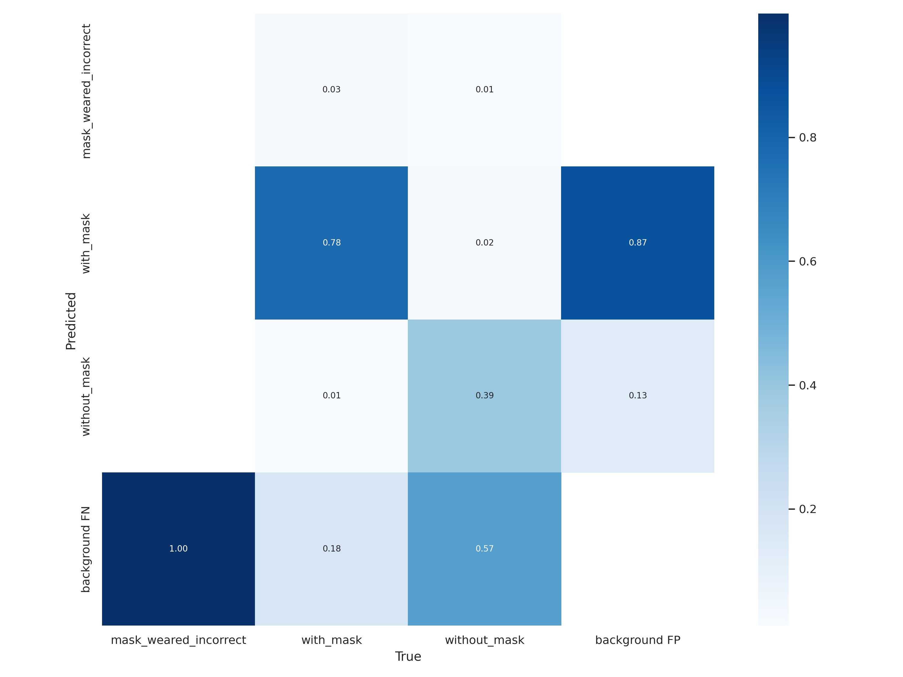
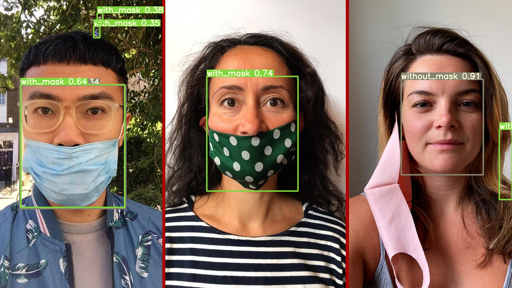

# Mask Detection

## YOLOv7

Implementation a paper - [YOLOv7: Trainable bag-of-freebies sets new state-of-the-art for real-time object detectors](https://arxiv.org/abs/2207.02696)

## Installation

- [LINK](https://github.com/WongKinYiu/yolov7/blob/main/requirements.txt)

```python
!pip install -r requirements.txt
```


## Weight



- `YOLOv7-X` 사용


## Data

- 😷[Kaggle_mask_detection](https://www.kaggle.com/datasets/andrewmvd/face-mask-detection) 사용

### Data tree

```python
root
├──annotations (folder)
├  ├── maksssksksss0.xml
├  ├── maksssksksss1.xml
├  ├── maksssksksssn.xml
├──images (folder)
├  ├── maksssksksss0.png
├  ├── maksssksksss1.png
├  ├── maksssksksssn.png
└──dd.yaml
```

### Preprocessing

> For now, preprocessed as [ROBOFLOW](https://roboflow.com/) 


> [`xml to txt`](https://github.com/Isabek/XmlToTxt)을 사용한 전처리 추가 예정

### Expected data tree when preprocessing

```python
root
├──train
├  ├──images
├  ├  ├──images01.png
├  ├──label
├  ├  ├──images01.txt
├──test
├  ├──images
├  ├  ├──images01.png
├  ├──label
├  ├  ├──images01.txt
├──valid
├  ├──images
├  ├  ├──images01.png
├  ├──label
├  ├  ├──images01.txt
├──data.yaml
```

## Performance

### Training






### Test





### Inference





